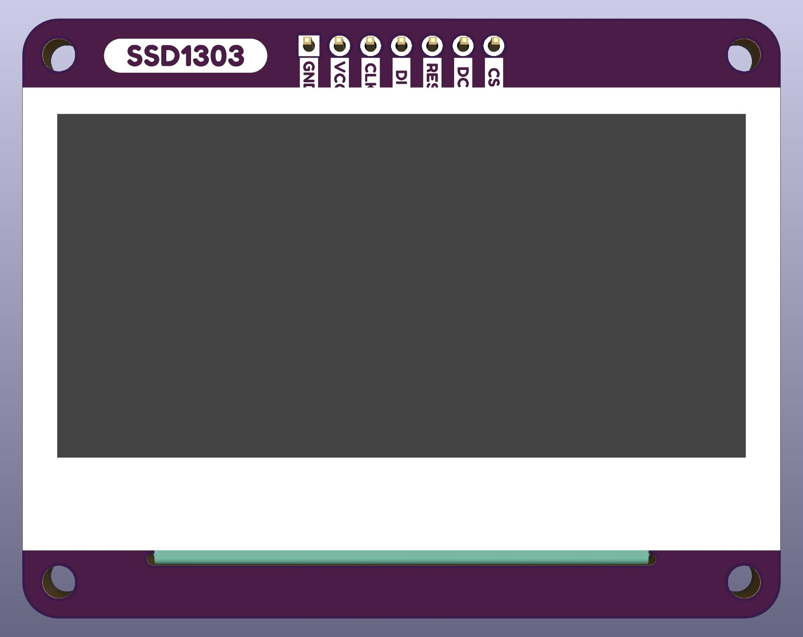
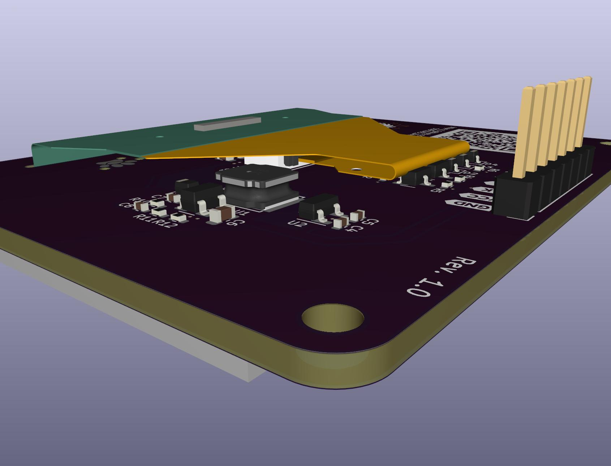
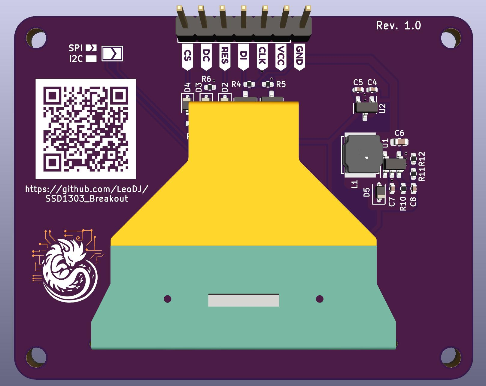
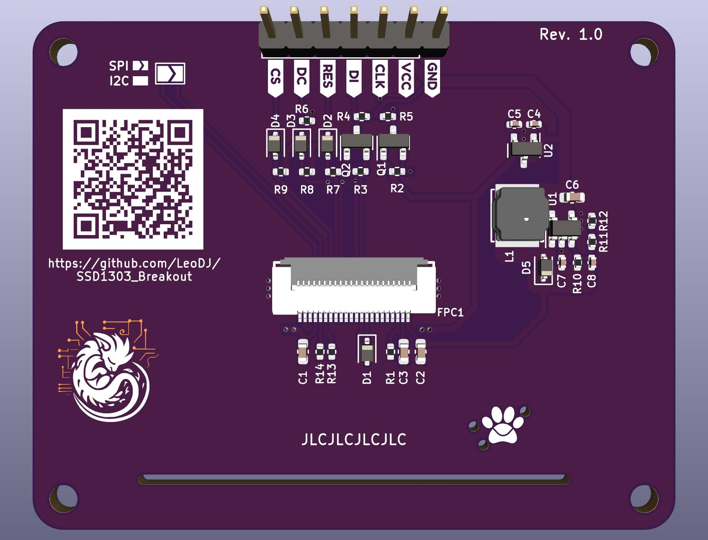

# SSD1303 Breakout Board

A breakout board for a specific SSD1303 OLED display.  
Optimized for low-cost PCB assembly services from a specific chinese manufacturer with blue logo.

You can [preview the PCB](https://kicanvas.org/?github=https%3A%2F%2Fgithub.com%2FLeoDJ%2FSSD1303_Breakout%2Fblob%2Fmain%2FSSD1303_Breakout.kicad_pcb) using the amazing KiCanvas. (Or the [schematic](https://kicanvas.org/?github=https%3A%2F%2Fgithub.com%2FLeoDJ%2FSSD1303_Breakout%2Ftree%2Fmain) if I forget to update the [PDF](./SSD1303_Breakout.pdf) ^^' )

## Pinout
| Pin | Function                                                                     |
|-----|------------------------------------------------------------------------------|
| GND | GND                                                                          |
| VCC | 3.3 - 5 V (up to ~250mA[^1])                                                 |
| CLK | SPI: `SCK`  I²C: `SCL`                                                    |
| DI  | SPI: `MOSI`  I²C: `SDA`                                                   |
| RES | Reset (active low)                                                           |
| DC  | SPI: data/command line  I²C: address. 0: `0x3C` / 1: `0x3D` (default low) |
| CS  | SPI: `CS`                                                                    |

* I/O pins are 5V tolerant
* To switch between SPI and I²C mode, you need to bridge / unbridge the solder jumper at the back (default is SPI)
* I've tried to make the pinout as compatible as possible to existing OLED modules, but there are many different variants

[^1]: Might draw up to ~250 mA @ 3.3V with all pixels on, guesstimated.  
I've measured roughly 50mA @ 12V with the highest brightness and all pixels on, so with pessimistic conversion losses around 750mW.

### Screenshots of revision 1.0 3D view
Somehow I got a bit carried away for a relatively simple design, but otoh I've learned a lot again.

  &nbsp;
  
  &nbsp;
  

